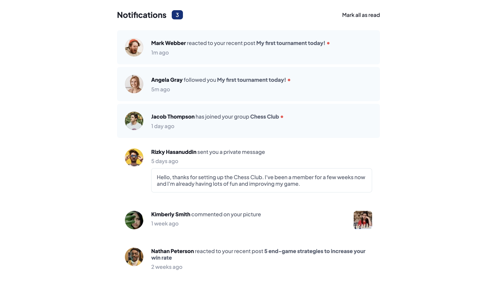

# Frontend Mentor - Notifications page solution

This is a solution to the [Notifications page challenge on Frontend Mentor](https://www.frontendmentor.io/challenges/notifications-page-DqK5QAmKbC). Frontend Mentor challenges help you improve your coding skills by building realistic projects. 

## Table of contents

- [Overview](#overview)
  - [The challenge](#the-challenge)
  - [Screenshot](#screenshot)
  - [Links](#links)
- [My process](#my-process)
  - [Built with](#built-with)
  - [What I learned](#what-i-learned)
  - [Continued development](#continued-development)
- [Author](#author)

**Note: Delete this note and update the table of contents based on what sections you keep.**

## Overview

### The challenge

Users should be able to:

- Distinguish between "unread" and "read" notifications
- Select "Mark all as read" to toggle the visual state of the unread notifications and set the number of unread messages to zero
- View the optimal layout for the interface depending on their device's screen size
- See hover and focus states for all interactive elements on the page

### Screenshot



### Links

- Live Site URL: [FrontEnd Mentor Notification Page](https://stevotronic.github.io/FrontendMentor-Notifications-page/)

## My process

### Built with

- Semantic HTML5 markup
- CSS custom properties
- Flexbox
- JavaScript

### What I learned

This was a nice exercise from beginning to end. I used different techniques to change the styles of the CSS when clicking on **Mark all as read**

For example:
```js
notificationCounter.innerHTML='0';
```
```js
element.classList.remove("newMessage");
```
and
```js
element.style.visibility='hidden'
```
At first I used `element.style.display='none'` but I found out that this way some elements moved a bit because it changed the flow of the site. Therefore I used `visibility='hidden'` which doesn't change the lay-out.


### Continued development

I will continue to do these challenges to grow. Maybe I will redo this one sometime with React.


## Author

- Website - [Stevotronic](https://stevotronic.github.io/PortfolioWebsite/)
- Frontend Mentor - [@Stevotronic](https://www.frontendmentor.io/profile/Stevotronic)

